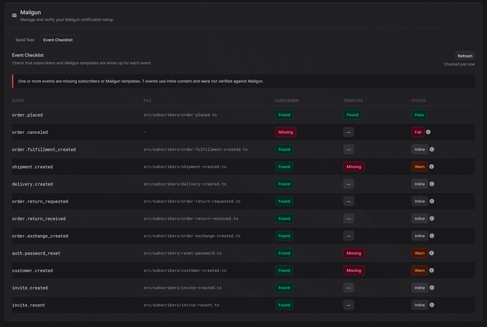
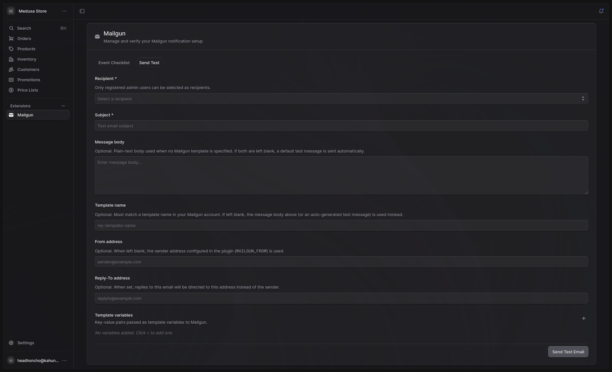

# medusa-notification-mailgun

[](https://github.com/burden/medusa-notification-mailgun/actions/workflows/test.yml)

Mailgun notification provider plugin for [MedusaJS](https://medusajs.com/) v2.

Sends transactional emails via the Mailgun HTTP API. Supports stored templates (with localization), inline HTML/text, file attachments, and includes an Admin UI page for sending test emails and verifying event coverage.

**Requires MedusaJS v2.3.0 or later.**

**In a hurry?** [Quickstart!](docs/quickstart.md) From install to first email in ~15 minutes.

## What this plugin provides

- **Notification provider** — registers `mailgun` as a notification provider for the `email` channel. Called automatically by Medusa when you use `createNotifications()` in a subscriber.
- **Admin API: send test email** — `POST /admin/mailgun/send-email`. Sends a test email to a registered admin user.
- **Admin API: event checklist** — `GET /admin/mailgun/checklist`. Scans your subscribers and Mailgun account to report coverage status for each tracked event.
- **Admin UI** — a "Mailgun" page in the Medusa admin sidebar with two tabs: "Event Checklist" (default) and "Send Test".

## Prerequisites

- Node.js v20+
- MedusaJS v2.3.0+
- A [Mailgun](https://www.mailgun.com/) account with a verified sending domain

## Installation

```bash
npm install medusa-notification-mailgun mailgun.js
# or
yarn add medusa-notification-mailgun mailgun.js
# or
pnpm add medusa-notification-mailgun mailgun.js
```

`mailgun.js` is a peer dependency — install it alongside the plugin.

## Configuration

Register the provider in `medusa-config.ts` inside the `notification` module:

```ts
import { defineConfig } from "@medusajs/framework/utils"

module.exports = defineConfig({
  // ...
  modules: [
    {
      resolve: "@medusajs/medusa/notification",
      options: {
        providers: [
          {
            resolve: "medusa-notification-mailgun/providers/notification-mailgun",
            id: "mailgun",
            options: {
              channels: ["email"],
              api_key: process.env.MAILGUN_API_KEY,
              domain: process.env.MAILGUN_DOMAIN,
              from: process.env.MAILGUN_FROM,  // optional
              region: "us",                     // optional, "us" | "eu"
            },
          },
        ],
      },
    },
  ],
})
```

### Options

| Option    | Required | Default              | Description                                           |
|-----------|----------|----------------------|-------------------------------------------------------|
| `api_key` | Yes      | —                    | Your Mailgun API key                                  |
| `domain`  | Yes      | —                    | Your verified Mailgun sending domain                  |
| `from`    | No       | `noreply@<domain>`   | Default sender address used when `from` is not passed per-notification |
| `region`  | No       | `"us"`               | Mailgun API region: `"us"` or `"eu"`                  |

## Environment variables

| Variable          | Required | Description                                                              |
|-------------------|----------|--------------------------------------------------------------------------|
| `MAILGUN_API_KEY` | Yes      | Your Mailgun API key                                                     |
| `MAILGUN_DOMAIN`  | Yes      | Your verified Mailgun sending domain                                     |
| `MAILGUN_FROM`    | No       | Default sender address                                                   |
| `MAILGUN_REGION`  | No       | Set to `"eu"` to use the EU API endpoint. Omit for US.                   |

Set these in your `.env` file:

```bash
MAILGUN_API_KEY=key-xxxxxxxxxxxxxxxxxxxxxxxxxxxxxxxx
MAILGUN_DOMAIN=mg.yourdomain.com
MAILGUN_FROM=no-reply@yourdomain.com
# MAILGUN_REGION=eu  # uncomment if your account is on the EU region
```

Reference these in `medusa-config.ts` via `process.env` — the checklist endpoint reads credentials from the same plugin options object, not from the environment directly.

## Sending notifications

The provider integrates with Medusa's built-in notification system. Call `createNotifications()` from a subscriber or workflow:

```ts
const notificationService = container.resolve(Modules.NOTIFICATION)

await notificationService.createNotifications({
  to: "customer@example.com",
  channel: "email",
  template: "order-confirmation",
  data: {
    subject: "Your order is confirmed",
    order_id: "ord_123",
    customer_name: "Alice",
  },
})
```

### The `data` payload

The `data` object controls how the email is built and carries template variables. All values must be strings.

| Field     | Type     | Description                                                                 |
|-----------|----------|-----------------------------------------------------------------------------|
| `subject` | `string` | Email subject line. Defaults to `"Notification"` if omitted.                |
| `locale`  | `string` | Selects a Mailgun template version (e.g. `"fr"`, `"de"`). Only used when `template` is set. |
| `html`    | `string` | Inline HTML body. Used when no `template` is set.                           |
| `text`    | `string` | Plain-text body. Used when neither `template` nor `html` is set.            |
| `from`    | `string` | Per-notification sender address override. Takes precedence over the top-level `from` field only when the top-level field is not set. |
| `replyTo` | `string` | Sets the `Reply-To` header on the outgoing message.                         |
| any other | `string` | Additional keys are passed to Mailgun as template variables.                |

### Content selection

The provider selects the message body using this priority order:

1. `template` — a Mailgun stored template; all `data` fields are passed as `h:X-Mailgun-Variables`.
2. `data.html` — raw HTML body (no template).
3. `data.text` — plain-text body.
4. Fallback — the entire `data` object is JSON-stringified and sent as plain text.

Use `data.html` or `data.text` when you want to generate content dynamically in code rather than maintain a template in the Mailgun dashboard.

### Stored template

```ts
await notificationService.createNotifications({
  to: "customer@example.com",
  channel: "email",
  template: "order-confirmation",
  data: {
    subject: "Your order is confirmed",
    order_id: "ord_123",
  },
})
```

Template variables are forwarded to Mailgun via `h:X-Mailgun-Variables` and available as `{{variable_name}}` inside Mailgun's Handlebars templates.

### Localized template

Create multiple versions of a template in the Mailgun dashboard, tagging each with a locale (e.g. `en`, `fr`, `de`). Pass `locale` in `data` to select the matching version:

```ts
await notificationService.createNotifications({
  to: "customer@example.com",
  channel: "email",
  template: "order-confirmation",
  data: {
    locale: "fr",
    subject: "Votre commande est confirmée",
    order_id: "ord_123",
  },
})
```

When `locale` is present, the plugin sets Mailgun's `t:version` parameter. If omitted, Mailgun uses the template's default version.

### Inline HTML

```ts
await notificationService.createNotifications({
  to: "customer@example.com",
  channel: "email",
  data: {
    subject: "Welcome!",
    html: "<h1>Welcome to our store</h1><p>Thanks for signing up.</p>",
  },
})
```

### Plain text

```ts
await notificationService.createNotifications({
  to: "customer@example.com",
  channel: "email",
  data: {
    subject: "Your receipt",
    text: "Thanks for your order. Your total was $42.00.",
  },
})
```

### Attachments

Pass base64-encoded file content in the `attachments` field:

```ts
await notificationService.createNotifications({
  to: "customer@example.com",
  channel: "email",
  data: { subject: "Your invoice", text: "See attached." },
  attachments: [
    {
      filename: "invoice.pdf",
      content: "<base64-encoded content>",
    },
  ],
} as any)
```

### Overriding the sender address

Pass a `from` field on the notification to override the plugin-level default for a single send:

```ts
await notificationService.createNotifications({
  to: "customer@example.com",
  channel: "email",
  from: "billing@yourdomain.com",
  data: { subject: "Invoice", text: "..." },
} as any)
```

`data.from` is also accepted, but is ignored when a plugin-level `from` is set in `medusa-config.ts`. The top-level `from` field shown above is the preferred method.

## Wiring up Medusa events to templates

Medusa fires events for commerce operations (order placed, shipment created, password reset, etc.) but sends no email by default. To send email on an event you need a Mailgun template and a subscriber that calls `createNotifications()` when the event fires.

See [`docs/medusa-notification-events.md`](docs/medusa-notification-events.md) for the complete how-to guide: subscriber patterns for each event, the full event reference, and suggested template variables.

New to the plugin? The [quickstart](docs/quickstart.md) walks through the full setup end-to-end.

## Admin UI

The plugin adds a **Mailgun** page to the Medusa admin sidebar (envelope icon). The route is `/mailgun`.

The page has two tabs:

- **Event Checklist** (default) — runs `GET /admin/mailgun/checklist` and displays per-event status as a table. Shows whether each tracked event has a subscriber, what template name was detected in the subscriber, and whether that template exists in Mailgun. For events with a confirmed Mailgun template, the template name is displayed below the event name in the table row.



- **Send Test** — form to send a test email to a registered admin user. Fields: recipient (dropdown of admin users), subject, optional message body, optional template name, optional from-address override, optional reply-to address, and optional key-value template variables.




## Admin API: send test email

```
POST /admin/mailgun/send-email
Authorization: Bearer <admin-jwt>
Content-Type: application/json
```

Sends a test email through the Mailgun notification provider.

### Request body

| Field      | Type                      | Required | Description                                                    |
|------------|---------------------------|----------|----------------------------------------------------------------|
| `to`       | `string` (email)          | Yes      | Recipient address. Must be a registered admin user email.      |
| `subject`  | `string`                  | Yes      | Email subject line.                                            |
| `template` | `string`                  | No       | Mailgun template name. If omitted, `data.text` or `data.html` is used for the body. |
| `from`     | `string` (email)          | No       | Sender address override. Defaults to the plugin's configured `from`. |
| `reply_to` | `string` (email)          | No       | Reply-To address. When set, replies are directed to this address instead of the sender. |
| `data`     | `Record<string, string>`  | No       | Template variables or body content (`html`, `text`). All values must be strings. |

**Constraint**: `to` must be the email address of a registered Medusa admin user. The endpoint looks up the address in the user service before sending. Arbitrary addresses are rejected.

If no template is specified and `data` contains neither `html` nor `text`, the plugin sends a plain-text fallback: `Test email — subject: <subject>`.

### Response

```json
{ "success": true, "notification_id": "noti_01..." }
```

### Example

```bash
curl -X POST https://yourstore.com/admin/mailgun/send-email \
  -H "Authorization: Bearer <admin-jwt>" \
  -H "Content-Type: application/json" \
  -d '{
    "to": "admin@yourstore.com",
    "subject": "Hello from Mailgun",
    "template": "welcome",
    "data": { "customer_name": "Alice" }
  }'
```

## Admin API: event checklist

```
GET /admin/mailgun/checklist
Authorization: Bearer <admin-jwt>
```

Returns a diagnostic report for all tracked Medusa events. For each event, the endpoint checks:

1. Whether a subscriber file exists in `src/subscribers/` that references the event name.
2. Whether that subscriber file contains a static `template:` string literal, and what its value is.
3. Whether that template exists in your Mailgun account (requires `api_key` and `domain` to be set in the plugin options in `medusa-config.ts`).

Per-event status values:

| Status   | Meaning                                                                         |
|----------|---------------------------------------------------------------------------------|
| `pass`   | Subscriber found, a static template name was detected in the file, and that template exists in Mailgun. |
| `warn`   | Subscriber found and a static template name was detected, but that template does not exist in Mailgun yet. |
| `inline` | Subscriber found, but no static template name was detected. The subscriber may be using inline HTML or plain text. |
| `fail`   | No subscriber found for this event.                                             |

The top-level `status` rolls up the worst result across all events, excluding `inline`. `inline` events do not cause a `warn` or `fail` rollup.

### CI usage

```bash
# Fail if any event is missing a subscriber or Mailgun template
curl -sf -H "Authorization: Bearer $MEDUSA_ADMIN_TOKEN" \
  "$MEDUSA_BACKEND_URL/admin/mailgun/checklist" \
  | jq -e '.status == "pass"'

# Fail only if a subscriber is missing; allow missing templates
curl -sf -H "Authorization: Bearer $MEDUSA_ADMIN_TOKEN" \
  "$MEDUSA_BACKEND_URL/admin/mailgun/checklist" \
  | jq -e '.status != "fail"'
```

See [`docs/checklist-endpoint.md`](docs/checklist-endpoint.md) for the full response shape, field descriptions, and additional CI patterns.

## Development

```bash
# Install dependencies
npm install

# Build the plugin
npm run build

# Start in watch/develop mode
npm run dev

# Run tests
npm test
```

This plugin uses the official Medusa plugin toolchain (`medusa plugin:build` / `medusa plugin:develop`).

### Local development with npm link

To test the plugin in a local Medusa project before publishing:

```bash
# In this plugin directory — build first, then link
npm run build
npm link

# In your Medusa project
npm link medusa-notification-mailgun
```

After any source change, run `npm run build` in the plugin directory again, or keep `npm run dev` running to rebuild continuously.

## Tests

The test suite uses Jest and ts-jest. Run with:

```bash
npm test
```

Coverage includes:

- `validateOptions` — rejects missing `api_key` or `domain`
- Template path — `h:X-Mailgun-Variables` header, `t:version` locale selection
- Inline HTML and plain-text paths
- Fallback path — JSON-stringified `data`
- Sender resolution — configured address vs. `noreply@<domain>` default
- Subject default (`"Notification"`) when `data.subject` is absent
- Base64 attachment decoding
- Mailgun API error wrapping (`error.details`, `error.message`, unknown errors)
- EU region endpoint selection (`https://api.eu.mailgun.net`)
- Return value — `id` field with `message` field fallback

## License

MIT
